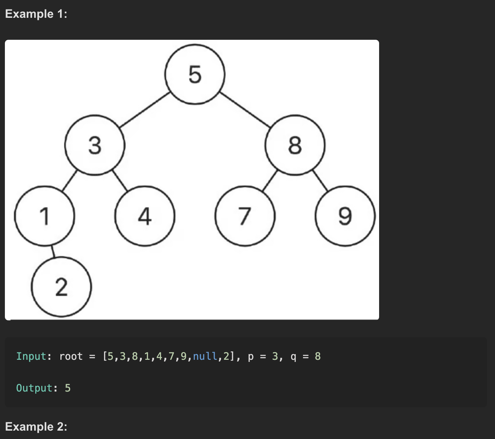
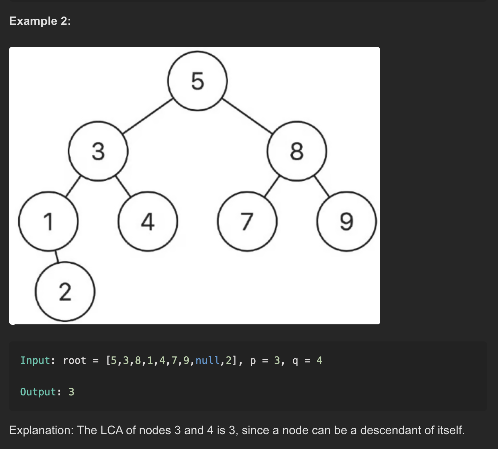

# 📄 Lowest Common Ancestor of a Binary Search Tree

## 📝 Problem — [LeetCode #235](https://leetcode.com/problems/lowest-common-ancestor-of-a-binary-search-tree/)

Given a **binary search tree (BST)**, find the **lowest common ancestor (LCA)** of two given nodes `p` and `q` in the BST.

> In a BST, the lowest common ancestor is defined as the lowest node in the tree that has both `p` and `q` as descendants (a node can be a descendant of itself).

---

## 📊 Examples

## 🚀 Approach

 Since the tree is a **Binary Search Tree**, we can use its properties to find the LCA efficiently:

- At each node:
  - If both `p` and `q` have values **less than current node**, move to the **left subtree**.
  - If both `p` and `q` have values **greater than current node**, move to the **right subtree**.
  - Otherwise, the current node is the **split point**, hence the **lowest common ancestor**.

We continue this process iteratively or recursively.

---

## ⏱️ Time Complexity
- **O(h)** where `h` is the height of the BST.
  - For a balanced BST: `O(log n)`
  - For a skewed BST: `O(n)`

---

## 📦 Space Complexity
- **O(1)** for iterative approach  
- **O(h)** for recursive approach (call stack)

---