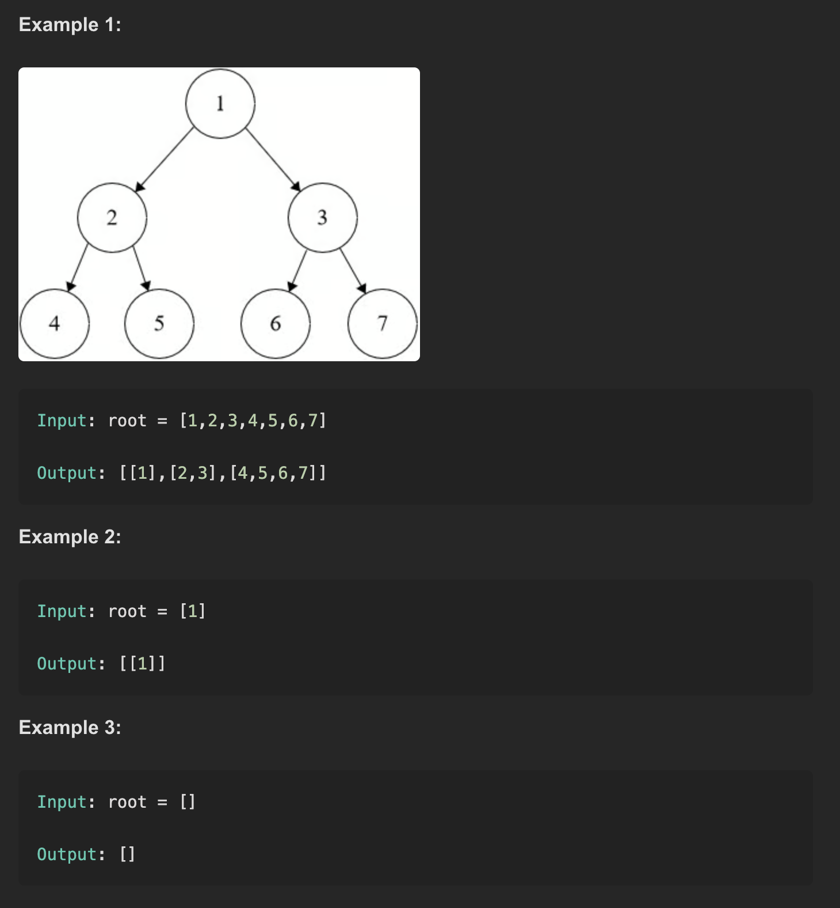

# LeetCode Problem #102: Binary Tree Level Order Traversal

## Problem Description
Given the root of a binary tree, return the level order traversal of its nodes' values. (i.e., from left to right, level by level).

You need to return a nested list where each sublist contains the values of nodes at a particular level of the tree.

---

## Examples

---

## Approach

- Use **Breadth-First Search (BFS)** to traverse the tree level by level.
- Utilize a queue to keep track of nodes to visit.
- For each level:
  - Determine the number of nodes (`levelSize`) currently in the queue.
  - Dequeue exactly `levelSize` nodes and record their values.
  - Enqueue their child nodes (left and right) if they exist.
- Append the list of values collected for each level to the final result list.
- Continue until all nodes have been processed.

This approach ensures nodes are grouped correctly by their level.

---

## Time Complexity

- **O(n)**, where *n* is the number of nodes in the tree.
- Each node is visited exactly once.

---

## Space Complexity

- **O(w)**, where *w* is the maximum width of the tree (maximum number of nodes at any level).
- Space is used by the queue and the output list.

---

## Notes

- This is the standard and optimal solution for level order traversal.
- BFS naturally fits this problem as it visits nodes level-wise.
