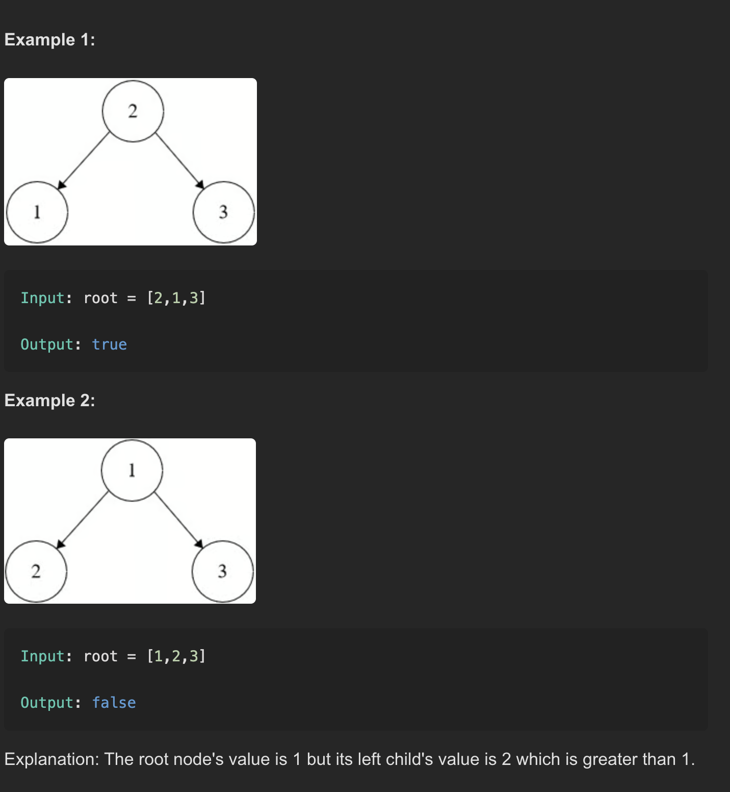

## ✅ LeetCode Problem #98: Validate Binary Search Tree

---

### 🧾 Description

Determine if a given binary tree is a valid **Binary Search Tree (BST)**.

A **valid BST** satisfies the following:
- The left subtree of a node contains only nodes with values **less than** the node’s value.
- The right subtree of a node contains only nodes with values **greater than** the node’s value.
- Both the left and right subtrees must also be valid binary search trees.

---

### 🖼️ Examples

---

### 🧠 Approach

We use a **recursive helper function** that checks whether the current node’s value is within a valid range (`min`, `max`). For every node:
- We update the `max` value for the **left subtree** to be the current node's value.
- We update the `min` value for the **right subtree** to be the current node's value.

We return `false` if a node violates the min-max rule. Otherwise, we keep checking recursively.

This approach ensures that **every node** in the tree satisfies the BST property, not just its immediate children.

---

### ⏱️ Time Complexity

- **O(n)**, where `n` is the number of nodes in the tree.  
  Each node is visited once.

---

### 💾 Space Complexity

- **O(h)**, where `h` is the height of the tree (due to recursion stack).  
  - In the worst case (unbalanced tree), space = O(n)  
  - In the best case (balanced tree), space = O(log n)

---
