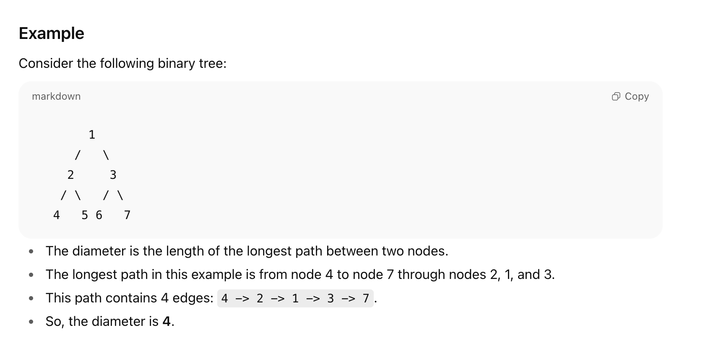

Diameter of Binary Tree - Leetcode Problem no 543

# Problem Description
Given the root of a binary tree, return the diameter of the tree.

The diameter of a binary tree is defined as the length (number of edges) of the longest path between any two nodes in the tree. The path may or may not pass through the root.

# Example 

# Approach
Use a Depth-First Search (DFS) traversal.
For each node:
Compute the height of its left subtree.
Compute the height of its right subtree.
The potential diameter passing through the node is the sum of left and right subtree heights.
Maintain a global variable maxDiameter to track the maximum diameter found so far.
The height of a node is max(leftHeight, rightHeight) + 1.
The DFS returns the height for each node, and updates maxDiameter accordingly.
Finally, return the value of maxDiameter.

# Time Complexity
The algorithm visits each node exactly once.

#Time complexity: O(n), where n is the number of nodes in the tree.

# Space Complexity
The space complexity is due to recursion stack.

In the worst case (skewed tree), recursion depth can be O(n).

In a balanced tree, recursion depth is O(log n).

