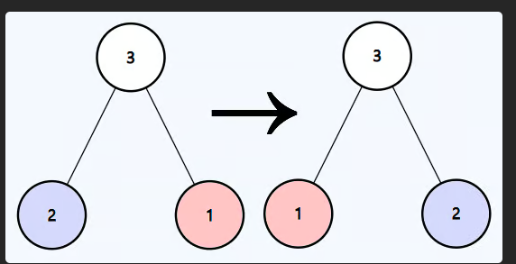

# Invert Binary Tree (LeetCode Problem #226)

## Problem Description

Given the root of a binary tree, invert the tree, and return its root.

## Visual Example

Here is a screenshot showing the binary tree before and after inversion:

---

## Approach

- Use recursion to invert the tree.
- For each node:
  1. Swap its left and right children.
  2. Recursively invert the left subtree.
  3. Recursively invert the right subtree.
- Base case: if the node is `null`, return `null`.

---

## Verifying the Inversion

You can verify the tree has been inverted by performing an **inorder traversal** (left-root-right) before and after inversion.

- For the original tree, inorder traversal prints the nodes in **ascending order**:

## Time Complexity

- **O(n)**, where `n` is the number of nodes in the tree.

## Space Complexity

- **O(h)**, where `h` is the height of the tree due to recursion stack.
- Worst case: `O(n)` for skewed tree.
- Best case: `O(log n)` for balanced tree.

---

