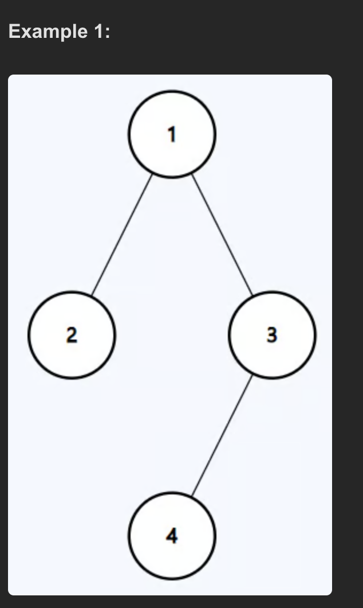

# LeetCode Problem #104: Maximum Depth of Binary Tree

**Problem Description:**  
Given the root of a binary tree, find its maximum depth. The maximum depth is the number of nodes along the longest path from the root node down to the farthest leaf node.

---

## Example

---

## Output

The maximum depth of the binary search tree is 3  
**Output:** 3

---

## Approach

1. Use recursion to traverse the tree.
2. Base case: If the current node is `null`, return 0 because there is no depth.
3. Recursively compute the maximum depth of the left subtree.
4. Recursively compute the maximum depth of the right subtree.
5. Return 1 plus the maximum of the depths of the left and right subtrees.

---

## Time Complexity

- **O(N)**, where N is the number of nodes in the tree.  
  Each node is visited exactly once.

---

## Space Complexity

- **O(H)**, where H is the height of the tree, corresponding to the recursion call stack space in the worst case (skewed tree).  
  For a balanced tree, space complexity is **O(log N)**.

---

## Additional Notes

- The depth of an empty tree (root is `null`) is 0.
- The function works by exploring all paths and returning the longest.

---
