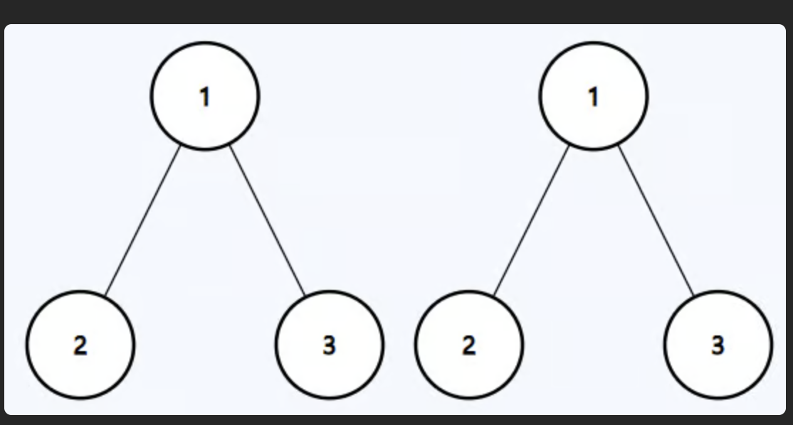
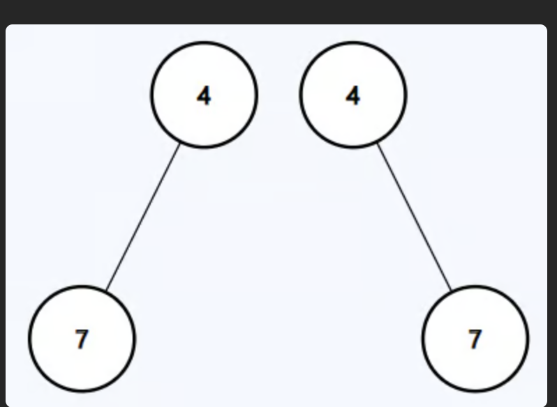

# LeetCode Problem #100: Same Tree

## 🧩 Problem Description
Given the roots of two binary trees `p` and `q`, write a function to check if they are the same or not.

Two binary trees are considered the same if they are structurally identical and the nodes have the same value.

---

## 🖼️ Examples

 Output: `true`

### 📂 Example 2 (example2.png)

 Output: `false`

## 💡 Approach

We use **recursion** to compare corresponding nodes of both trees:

1. If both nodes are `null`, they are the same.
2. If one is `null` and the other isn't, they are not the same.
3. If both nodes exist but their values differ, return `false`.
4. Recursively check:
   - left subtree of both trees
   - right subtree of both trees
5. Return `true` only if both left and right subtrees are also the same.

# Time Complexity
O(N) — Each node is visited once, where N is the total number of nodes.

# Space Complexity 
O(H) — Due to recursion call stack, where H is the height of the tree.

- Best case: O(log N) for balanced trees

- Worst case: O(N) for skewed trees

