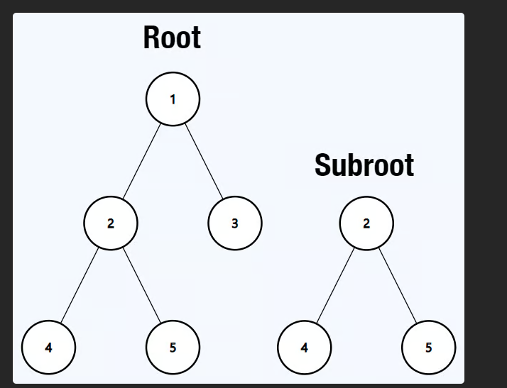

# 🌳 LeetCode 572 – Subtree of Another Tree (Java)

> **Link:** [LeetCode Problem 572](https://leetcode.com/problems/subtree-of-another-tree/)

---

## 🧾 Problem Statement

Given the roots of two binary trees `root` and `subRoot`, return `true` if there is a subtree of `root` with the same structure and node values as `subRoot`, and `false` otherwise.

A **subtree** of a binary tree is a tree that consists of a node in the tree and all of this node's descendants. A tree can also be considered a subtree of itself.

---

## Example 1

# Output
   True 

## Example 2

# Output
  False

---

## 💡 Approach

We recursively traverse the `root` tree, and for each node, we check if the subtree rooted at that node matches the `subRoot` using a recursive comparison of structure and values.

### Steps:
1. If `subRoot` is `null`, it's a subtree of any tree → return `true`.
2. If `root` is `null` but `subRoot` is not, return `false`.
3. If the current node of `root` matches `subRoot`, check if their structures and values are identical.
4. Otherwise, recursively check the left and right subtrees of `root`.

## ⏱️ Time and Space Complexity

| Complexity | Explanation |
|------------|-------------|
| 🕒 Time     | `O(m * n)` in the worst case, where `m` = nodes in `root`, `n` = nodes in `subRoot`. At each node in `root`, we may compare with all of `subRoot`. |
| 💾 Space    | `O(h)` where `h` is the height of the tree (due to recursive stack). In worst case, `O(m)` if the tree is skewed. |

---

