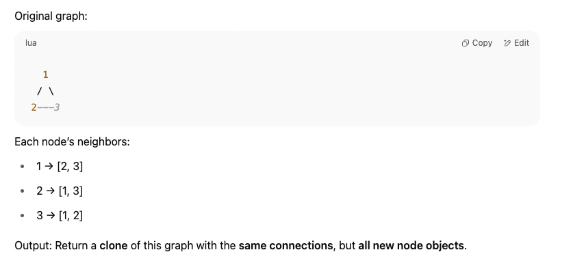

LeetCode 133. Clone Graph
# 📝 Description:
Given a reference to a node in a connected undirected graph, return a deep copy (clone) of the graph.

Each node contains a value (val) and a list of its neighbors.

The cloned graph must have new node instances with the same structure as the original, and no shared references with the original graph.

# 📘 Example:

# 🚀 Approach:
Use Depth-First Search (DFS) to traverse and clone each node.

Use a HashMap (visited map) to keep track of already cloned nodes to avoid infinite loops and repeated work.

For each node:

If the node has already been cloned, return its clone.

Otherwise, create a new node (clone), add it to the map.

Recursively clone all its neighbors and add them to the new node’s neighbors list.

This ensures every unique node is cloned exactly once and all connections are preserved.

# ⏱️ Time Complexity:
O(N) where N is the number of nodes.

Each node and edge is visited exactly once.

# 📦 Space Complexity:
O(N) for:

The recursion stack (in the worst case)

The visited map storing all cloned nodes.