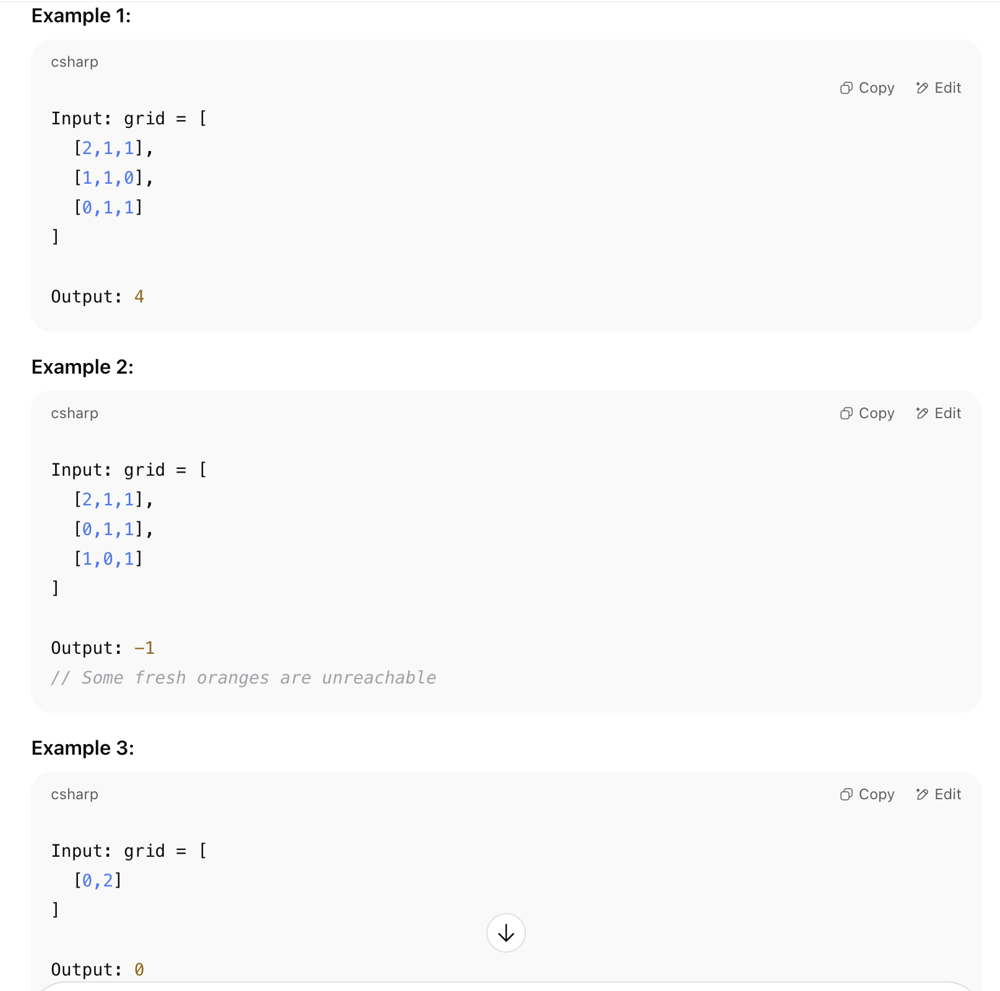

# 🍊 Rotting Oranges
LeetCode Problem Number: 994
Category: Graph / BFS

# 📝 Problem Description
You are given an m x n grid representing a box of oranges.

Each cell in the grid can have one of three values:

0 – an empty cell

1 – a fresh orange

2 – a rotten orange

Every minute, any fresh orange that is 4-directionally adjacent to a rotten orange becomes rotten.

Return the minimum number of minutes that must elapse until no fresh orange remains.
If it's impossible to rot all fresh oranges, return -1.

# 📌 Examples

# 🚀 Approach
Use BFS to simulate the minute-by-minute spread of rot.

Add all initial rotten oranges to a queue.

Count total fresh oranges in the grid.

Perform BFS layer-by-layer:

For each minute (level), process all rotten oranges.

For each rotten orange, rot its adjacent fresh ones and reduce the fresh count.

Only increment minutes if at least one new orange was rotted in that round.

After BFS:

If freshCount == 0, return the total minutes.

Else, return -1 (some oranges couldn’t be reached).

# ⏱️ Time Complexity
O(m × n) — where m is rows and n is columns.

Each cell is visited at most once during BFS.

# 🧠 Space Complexity
O(m × n) — in the worst case, all oranges are added to the queue.

