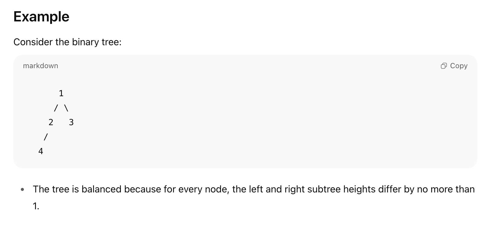

# Balanced Binary Tree
Leetcode Problem number #110
# Problem Description
Given a binary tree, determine if it is height-balanced.

A binary tree is height-balanced if for every node in the tree, the difference in height between its left and right subtrees is at most 1.

# Example

# Approach
We use a bottom-up recursive approach with post-order traversal:

Base Case:
If the node is null, it is balanced with height 0.

Recursive Calls:
Recursively get the balance status and height of the left and right subtrees.

Check Current Node:

The current node is balanced if both subtrees are balanced, and

The difference in height between left and right subtree is at most 1.

Calculate Height:
Height of the current subtree is 1 + max(left height, right height).

Return:
Return a pair containing the balanced status (true/false) and the height of the subtree.

Final Result:
The tree is balanced if the root subtree is balanced.

# Time Complexity
O(n), where n is the number of nodes, since each node is visited once.

# Space Complexity
O(h), where h is the height of the tree, due to the recursion stack.

