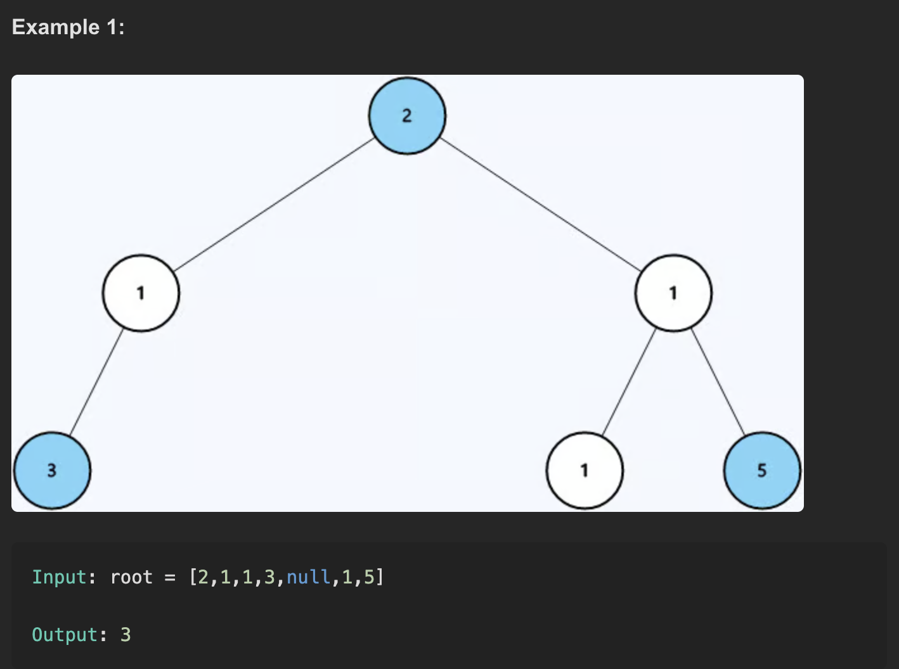

LeetCode 1026 – Maximum Difference Between Node and Ancestor
# Problem description
Given the root of a binary tree, find the maximum value |ancestor.val - node.val| over all pairs where ancestor is on the path from the root to the node.

# Examples

# Approach 

Use DFS (preorder).

Carry two values along the path: minSoFar and maxSoFar seen from root to current node.

At each node, the best difference using this node is max(|node.val − minSoFar|, |node.val − maxSoFar|).

Update minSoFar = min(minSoFar, node.val) and maxSoFar = max(maxSoFar, node.val).

Recurse into left and right children with updated min/max.

Track a global/returned maximum over all nodes.

# Time complexity
O(N), visit each node once.

# Space complexity
O(H) for recursion stack, where H is tree height (O(log N) average, O(N) worst in a skewed tree).

