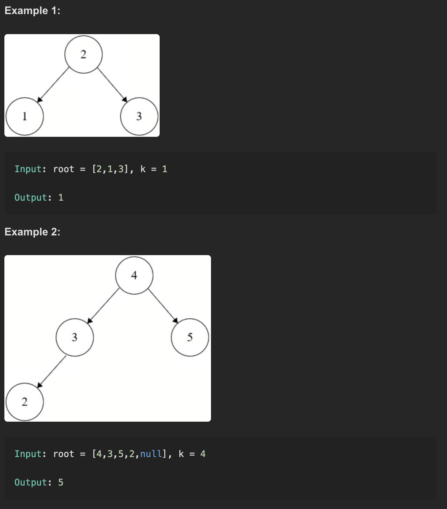

# Kth Smallest Element in a BST

LeetCode Problem 230

# 📄 Description

Given the root of a binary search tree (BST) and an integer k, return the k-th smallest value (1-indexed) of all the values of the nodes in the tree.

# 🖼️ Examples

# 💡 Approach

# Full-list Method

- Perform an in-order traversal (left → node → right), which gives nodes in ascending order.

- Store all visited node values into a list.

- Return the element at index k-1.

- Optimized Early-Exit Method

- Perform in-order traversal with a counter.

- Stop the traversal as soon as the k-th node is visited.

- Return that node’s value immediately.

# ⏱️ Time & Space Complexity

# Method

- Time Complexity (O(n))

- Space Complexity (O(n))

# Where:

n = total number of nodes in the tree

