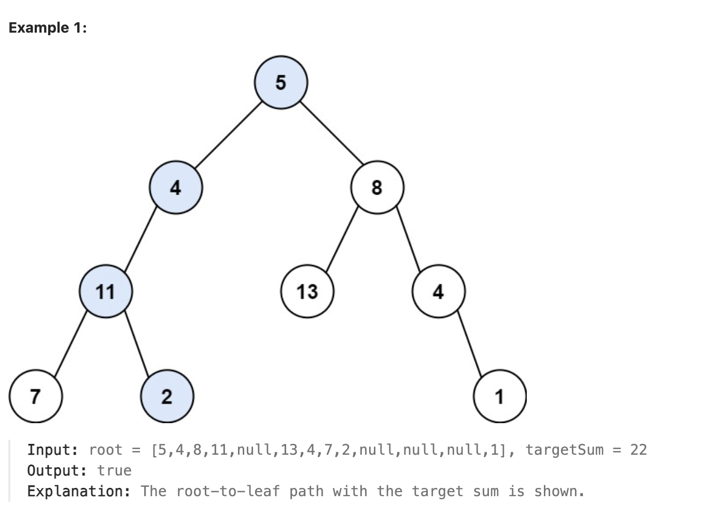
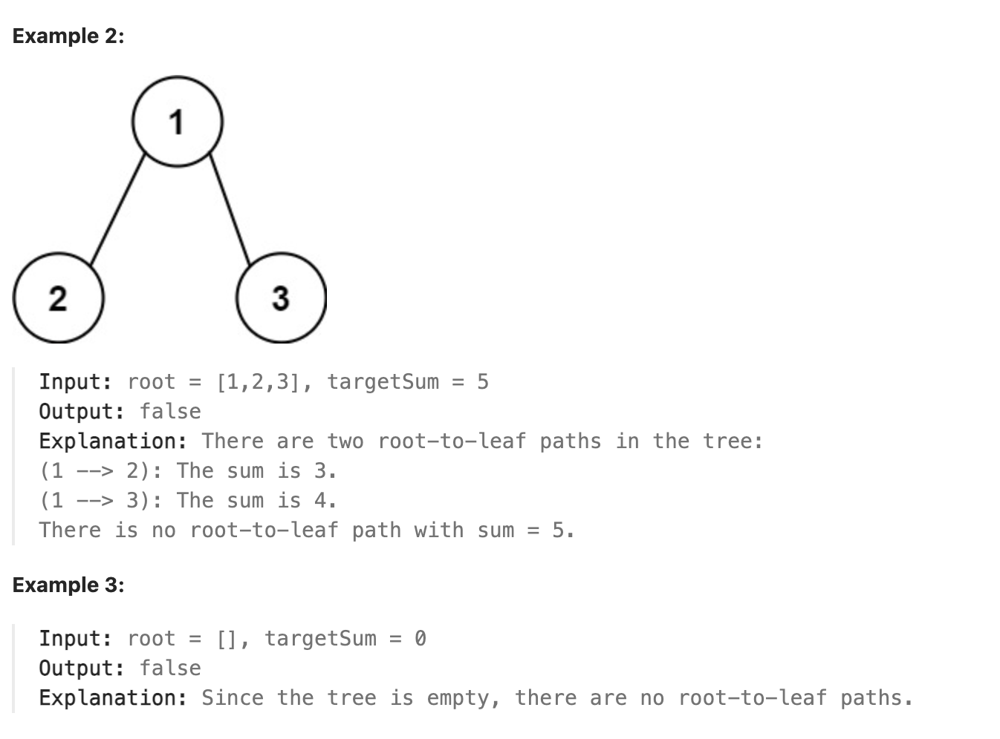

LeetCode 112 — Path Sum
# Problem Description
Given the root of a binary tree and an integer targetSum, return true if the tree has a root-to-leaf path such that adding up all the values along the path equals targetSum.
A leaf is a node with no children.

# Examples

# Approach
Use DFS starting from the root.

Keep a remaining sum that starts as targetSum.

At each node:

Subtract the node’s value from remaining.

If it’s a leaf and remaining == 0, return true.

Recursively check left or right child (||) and pass the updated remaining.

Return true if any root-to-leaf path satisfies the condition.

# Time Complexity: O(n) 
 visit each node once in the worst case.

# Space Complexity: O(h) 
recursion stack, where h = height of the tree

Balanced tree: O(log n)

Skewed tree: O(n)

