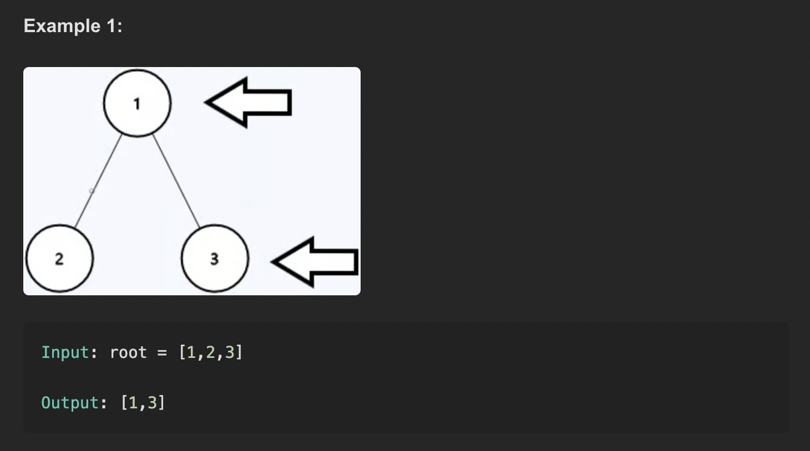
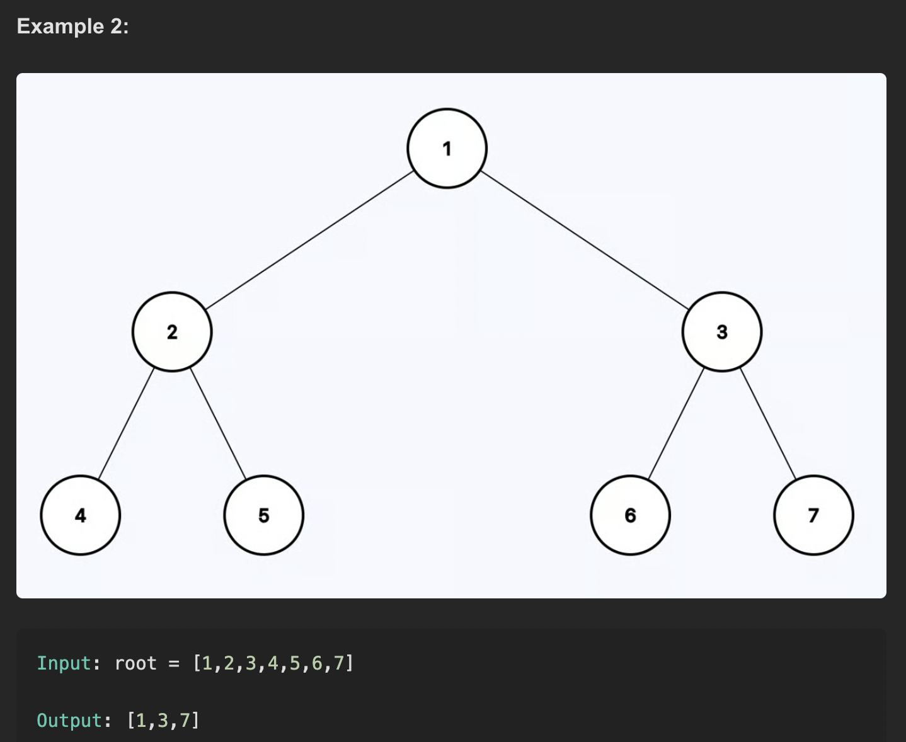

LeetCode 199 — Binary Tree Right Side View
# Problem Description
Given the root of a binary tree, return the values of the nodes you can see from the right side. Return them in order from top to bottom (one value per level: the rightmost visible node of that level).

# Examples

# Approach 
BFS (Level Order) — Recommended
Use a queue for level-order traversal.

For each level, process all nodes in that level (track size).

Record only the last node encountered at that level (the rightmost).

Enqueue both children of every node (left and right) so you don’t miss cases where a left branch is visible due to missing right children above.

Why both children?
A deeper level’s visible node can come from the left subtree if the right path is missing at some level.

# Complexity
Time: O(n) for both BFS and DFS (each node visited once).

Space:
BFS: O(w) where w is the max width; worst-case O(n) (queue can hold a full level).

DFS: O(h) recursion stack; worst-case O(n) for a skewed tree, O(log n) for balanced.

