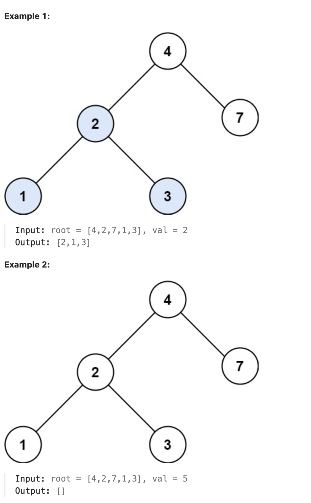

# LeetCode Problem 700 - Search in a Binary Search Tree

## 🧩 Problem Number
**700. Search in a Binary Search Tree**

## 📄 Problem Description
Given the root of a binary search tree (BST) and an integer value `val`, return the subtree rooted with the node that has the value equal to `val`. If such a node does not exist, return `null`.

🔗 [LeetCode Link](https://leetcode.com/problems/search-in-a-binary-search-tree/)

---

## 🧪 Example

---

## ✅ Result
- If the target value exists in the BST, the node is returned.
- If the target value does not exist, `null` is returned.

---

## 💡 Approach
- Start from the root node.
- If the current node’s value equals the target, return it.
- If the target is smaller, search the left subtree.
- If the target is larger, search the right subtree.
- If the node is `null`, the value is not present.

---

## ⏱️ Time Complexity
- **Average Case:** O(log n)
- **Worst Case:** O(n) (when the tree is skewed)

## 🧠 Space Complexity
- **Recursive Depth:** O(h), where `h` is the height of the tree
