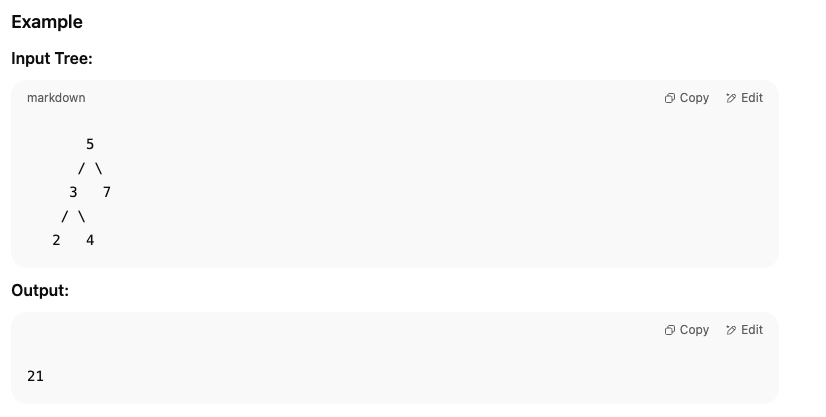

Problem: Sum of All Nodes in a Binary Tree
# Description
Given the root of a binary tree, calculate and return the sum of the values of all nodes in the tree.

# Example

# Approach (BFS)

Use a queue to perform level order traversal (BFS).

Initialize sum = 0.

Add the root node to the queue.

While the queue is not empty:

Remove the front node.

Add its value to sum.

If the node has a left child, add it to the queue.

If the node has a right child, add it to the queue.

Return the final sum.

# Time Complexity

O(n) — Each node is visited once.

# Space Complexity

O(n) — In the worst case, the queue holds all nodes at the largest level of the tree.